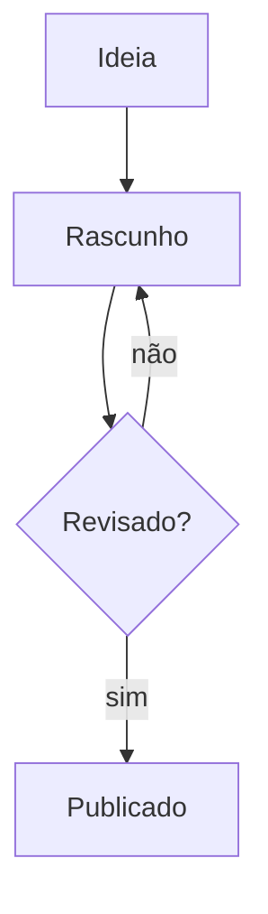
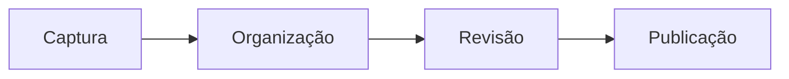

# Markdown e Obsidian

Este vault usa Markdown — texto simples com marcações legíveis mesmo sem renderização. O Obsidian adiciona extensões úteis como wikilinks, callouts e embeds. Esta nota serve como referência rápida da sintaxe disponível e do que funciona no **site publicado** versus o que é **exclusivo do Obsidian**.

![[vault-seed-banner.svg|Diagrama de notas interligadas brotando de uma semente central]]

---

## Formatação básica

```markdown
**negrito**          _itálico_          ~~riscado~~
`código inline`      ==destacado==      ^sobrescrito^
```

**negrito** · _itálico_ · ~~riscado~~ · `código inline`

> **No site:** negrito, itálico, riscado e código inline renderizam normalmente.
> Destaque (`==`) e sobrescrito (`^`) são extensões do Obsidian e **não** renderizam no site.

---

## Títulos

```markdown
# Título H1     (evite — o Starlight já insere o H1 a partir do frontmatter)
## Seção H2
### Subseção H3
#### H4, H5, H6 também disponíveis
```

> **No site:** todos os níveis renderizam. O H1 é gerado automaticamente pelo Starlight
> a partir do campo `title:` do frontmatter — não inclua `# Título` no corpo da nota.

---

## Listas

```markdown
- Item simples
- Outro item
  - Item aninhado (dois espaços de indentação)

1. Passo numerado
2. Próximo passo
   1. Sub-passo

- [ ] Tarefa pendente
- [x] Tarefa concluída
```

> **No site:** listas ordenadas e não ordenadas renderizam. Listas de tarefas renderizam
> como checkboxes HTML (não interativos). Listas de tarefas dinâmicas do plugin Tasks
> são exclusivas do Obsidian.

---

## Links

```markdown
[Link externo](https://obsidian.md)
[[Nome da Nota]]                       — link interno (wikilink)
[[Nome da Nota|Texto alternativo]]     — wikilink com rótulo customizado
[[Nome da Nota#Seção]]                 — link para uma seção específica
```

> **No site:** links externos sempre renderizam. Wikilinks para notas com
> `status: published` viram `<a>` clicáveis. Wikilinks para notas não publicadas
> ou privadas viram texto simples (sem link quebrado).

---

## Imagens

### Markdown padrão

```markdown


```

### Wikilink de imagem — sintaxe Obsidian

```markdown
![[nome-do-arquivo.png]]
![[nome-do-arquivo.png|Texto alternativo descritivo]]
```

O Obsidian salva anexos em `99 - Meta e Anexos/Anexos/` (configurado em
`.obsidian/app.json`). Durante o build do site, esses arquivos são copiados
automaticamente para `public/assets/`, tornando-os acessíveis pelo caminho
`/assets/nome-do-arquivo.png`.

**Formatos suportados:** PNG, JPG/JPEG, GIF, SVG, WebP.

**Dimensionando no Obsidian:** `![[imagem.png|400]]` (largura em pixels, exibição
local apenas — não tem efeito no site publicado).

> **No site:** o plugin `remarkWikiImages` converte `![[...]]` em `` com
> `loading="lazy"` automaticamente. O texto após `|` vira o atributo `alt`,
> importante para acessibilidade. Sempre forneça um texto alternativo descritivo.

---

## Tabelas

```markdown
| Coluna A     | Coluna B     | Coluna C     |
|:-------------|:------------:|-------------:|
| alinhado esq | centralizado | alinhado dir |
| célula       | célula       | célula       |
```

| Sintaxe      | Obsidian | Site publicado |
|:-------------|:--------:|:--------------:|
| `:-`         | ✓        | ✓              |
| `:-:`        | ✓        | ✓              |
| `-:`         | ✓        | ✓              |

---

## Blocos de código

````markdown
```python
def saudacao(nome: str) -> str:
    return f"Olá, {nome}!"
```
````

O site usa **Expressive Code** para syntax highlighting com mais de 100 linguagens,
botão de cópia e suporte a temas claro/escuro.

---

## Citações e callouts

### Citação simples (blockquote)

```markdown
> Esta é uma citação ou nota lateral.
> Pode ter múltiplas linhas.
```

### Callouts (extensão Obsidian)

```markdown
> [!NOTE]
> Uma nota informativa.

> [!TIP] Dica personalizada
> Conteúdo da dica.

> [!WARNING]
> Atenção: algo importante a considerar.

> [!DANGER] Perigo
> Ação irreversível ou de alto risco.
```

**Tipos disponíveis:** `NOTE`, `TIP`, `INFO`, `SUCCESS`, `QUESTION`, `WARNING`,
`CAUTION`, `DANGER`, `BUG`, `EXAMPLE`, `QUOTE` — e aliases como `HINT`, `IMPORTANT`,
`ABSTRACT`, `ERROR`.

> [!TIP] Callouts no site
> O plugin `remarkCallouts` processa a sintaxe `> [!TIPO]` e gera um `<aside>`
> semântico com classe `callout callout-tipo`. A aparência é controlada em
> `.site/styles/custom.css`.

---

## Diagramas Mermaid

````markdown

````



> **No site:** Mermaid é renderizado no lado do cliente via CDN
> (`mermaid.esm.min.mjs`). O bloco de código é substituído pelo SVG gerado após
> o carregamento da página. Funciona com View Transitions.

---

## Frontmatter YAML

Todo arquivo de conteúdo começa com um bloco frontmatter entre `---`:

```yaml
---
title: Minha Nota
aliases:
  - Nome alternativo
tags:
  - categoria/subcategoria
status: published          # published | draft | private
created: 2026-01-15
updated: 2026-05-21
category: conceito         # ferramenta | guia | referência | conceito
audience: iniciante        # iniciante | intermediario | tecnico | todos
related:
  - "[[Outra Nota]]"
sidebar:
  order: 2                 # posição na seção da sidebar (menor = primeiro)
  label: Rótulo alternativo
  hidden: false
---
```

Campos que afetam o **site publicado**:
- `title` — usado como `<h1>` e título na sidebar
- `status: published` — obrigatório para que a nota apareça no site
- `sidebar.order` — ordena notas dentro de uma seção
- `sidebar.label` — exibe um rótulo alternativo na sidebar
- `sidebar.hidden: true` — oculta da sidebar mas mantém a página acessível via link direto

---

## O que funciona onde

| Funcionalidade               | Obsidian | Site publicado |
|:-----------------------------|:--------:|:--------------:|
| Markdown padrão              | ✓        | ✓              |
| Wikilinks para notas         | ✓        | ✓ (publicadas) |
| Imagens `![[...]]`           | ✓        | ✓              |
| Callouts `> [!TIPO]`         | ✓        | ✓              |
| Mermaid                      | ✓        | ✓ (via CDN)    |
| Frontmatter YAML             | ✓        | ✓              |
| Dataview / Bases             | ✓        | ✗              |
| Embeds de nota `![[Nota]]`   | ✓        | ✗              |
| Canvas `.canvas`             | ✓        | ✗              |
| Tarefas dinâmicas (Tasks)    | ✓        | ✗ (estático)   |
| Destaque `==texto==`         | ✓        | ✗              |
| Excalidraw                   | ✓        | ✗              |

---

## Referências

- [Guia de Markdown do Obsidian](https://help.obsidian.md/Editing+and+formatting/Basic+formatting+syntax)
- [Especificação CommonMark](https://spec.commonmark.org/)
- [Documentação do Mermaid](https://mermaid.js.org/intro/)
- [Expressive Code (syntax highlighting)](https://expressive-code.com/)

---

Voltar para [[MOC Vault Seed]]
