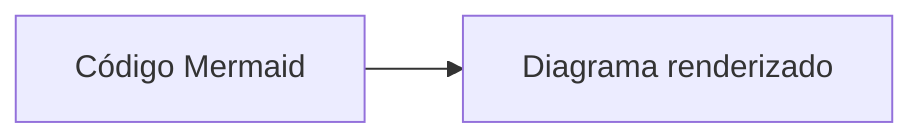
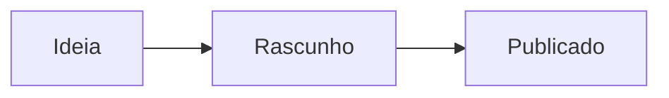
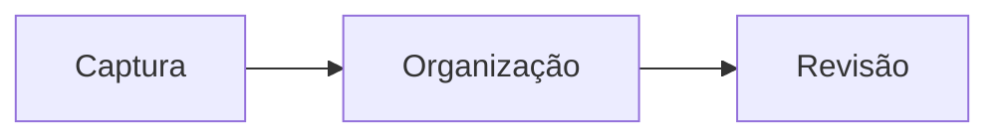
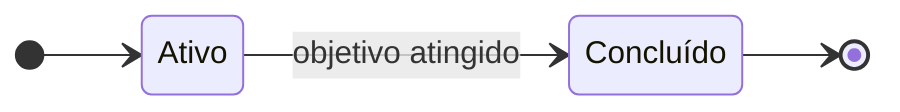

# Mermaid

Mermaid é uma linguagem de marcação para criar diagramas dentro de blocos de código Markdown. Em vez de usar uma ferramenta gráfica, você descreve o diagrama em texto e ele é renderizado visualmente.



---

## Como usar

Crie um bloco de código com a linguagem `mermaid`:

````markdown

````

---

## Tipos de diagrama suportados

| Tipo | Declaração | Uso |
|:-----|:-----------|:----|
| Fluxograma | `flowchart TD` / `graph LR` | Processos e decisões |
| Sequência | `sequenceDiagram` | Interações entre sistemas |
| Estado | `stateDiagram-v2` | Ciclos de vida e estados |
| Entidade-Relacionamento | `erDiagram` | Modelos de dados |
| Gantt | `gantt` | Cronogramas |
| Torta | `pie` | Distribuições |
| Git | `gitGraph` | Fluxo de branches |
| Mapa mental | `mindmap` | Hierarquias e conceitos |
| Linha do tempo | `timeline` | Eventos ordenados |

---

## Regras de sintaxe para o site publicado

O Mermaid no site usa o renderizador oficial via CDN, que aplica as mesmas regras do Mermaid v11. Alguns padrões funcionam no Obsidian mas falham no site.

### IDs de nó devem ser ASCII

Em flowcharts e grafos, o **identificador** (ID) do nó precisa usar apenas letras ASCII, dígitos, `_` e `-`. O label visível pode conter qualquer texto, inclusive acentos e emoji, mas precisa estar entre aspas.



```markdown
%% ✓ correto — ID ASCII, label em aspas
A["Organização"] --> B["Revisão"]

%% ✗ erro — ID não-ASCII usado diretamente
Organização --> Revisão
```

### Emoji e caracteres especiais em labels

Labels dentro de `()` precisam de aspas quando contêm emoji ou acentos:

```markdown
%% ✓ correto
KW1("📝 Usar Templates"):::action

%% ✗ erro — emoji em label não-quotado quebra o lexer do Mermaid
KW1(📝 Usar Templates):::action
```

Use sempre `("label")` ou `["label"]` quando o texto tiver emoji, `/`, ou caracteres fora do ASCII básico.

### Estados com acentos em stateDiagram-v2

Use o alias `state "Label" as ID` para separar o nome visível (com acentos) do ID (ASCII):



```markdown
%% ✓ correto
state "Concluído" as Concluido
Ativo --> Concluido

%% ✗ erro — ID com acento
Ativo --> Concluído
```

### Wikilinks em labels de aresta

Wikilinks (`[[Nota]]`) dentro de labels de aresta quebram o lexer do Mermaid. Use texto simples:

```markdown
%% ✓ correto
A -- "ver wikilinks" --> B

%% ✗ erro — [[wikilink]] em label
A -- "ver [[Wikilinks]]" --> B
```

### Valores de classDef não podem ter espaços

Em definições de estilo (`classDef`), cada valor de propriedade CSS não pode conter espaços — o parser usa espaço como separador de tokens. Isso afeta propriedades como `stroke-dasharray`:

```markdown
%% ✓ correto — valor sem espaço
classDef destaque fill:#fff0e6,stroke:#ff8c1a,stroke-dasharray:5

%% ✗ erro — espaço dentro do valor quebra o diagrama inteiro
classDef destaque fill:#fff0e6,stroke:#ff8c1a,stroke-dasharray:5 5
```

---

## O que funciona onde

| Funcionalidade | Obsidian | Site publicado |
|:---------------|:--------:|:--------------:|
| Todos os tipos listados acima | ✓ | ✓ |
| Labels com acentos (entre aspas) | ✓ | ✓ |
| Emoji em labels (entre aspas) | ✓ | ✓ |
| `direction LR / TD` em stateDiagram | ✓ | ✓ |
| IDs de nó com acentos | ✓ | ✗ |
| Emoji em labels sem aspas | ✓ | ✗ |
| `[[wikilinks]]` em labels de aresta | ✓ | ✗ |
| Tema claro/escuro automático | ✓ | ✓ (via CDN) |
| Copiar código-fonte do diagrama | ✗ | ✓ ("Copiar fonte") |
| Copiar SVG renderizado | ✗ | ✓ ("Copiar SVG") |

> [!TIP] Validação automática
> O vault inclui um validador que detecta padrões problemáticos antes do build:
> ```bash
> pnpm run validate:mermaid
> ```

---

## Exemplos prontos

Para ver todos os tipos de diagrama em ação, consulte [[Diagramas do Vault]]. Os exemplos lá incluem o fluxo de gestão de conhecimento, a estrutura PARA, o ciclo de revisão diária e o ciclo de vida de projeto.

---

## Referências

- [Documentação do Mermaid](https://mermaid.js.org/intro/)
- [Editor online do Mermaid](https://mermaid.live)

---

Voltar para [[MOC Vault Seed]]
