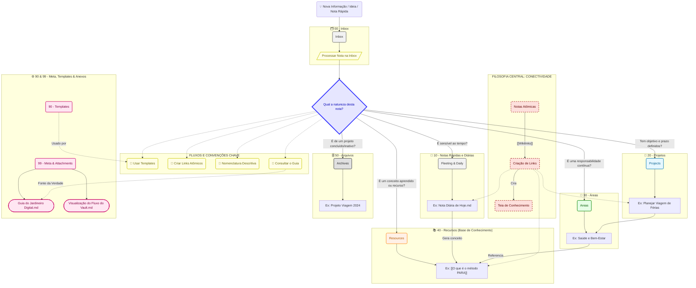

# Visualização do Fluxo do Vault

Para uma representação visual da estrutura de pastas e das conexões entre as notas, você pode visualizar o mapa mental do vault.

---
Voltar para o [[Guia do Jardineiro Digital]]
