# Visualização do Fluxo do Vault

Para uma representação visual da estrutura de pastas e das conexões entre as notas, você pode visualizar o mapa mental do vault.

```mermaid
flowchart TD
    %% --- Título do Diagrama e Configuração Global ---
    %% @title Fluxo de Gestão de Conhecimento (PKM)

    %% --- Definições de Estilo de Classe ---
    classDef inbox fill:#f2f2f2,stroke:#666,stroke-width:2px,color:#333
    classDef projects fill:#e6f7ff,stroke:#0077b3,stroke-width:2px,color:#005c8a
    classDef areas fill:#e6ffe6,stroke:#008000,stroke-width:2px,color:#005900
    classDef knowledge fill:#fff0e6,stroke:#ff8c1a,stroke-width:2px,color:#b35900
    classDef archives fill:#e0e0e0,stroke:#404040,stroke-width:2px,color:#262626
    classDef meta fill:#ffe6f2,stroke:#cc0066,stroke-width:2px,color:#800040
    classDef action fill:#fffde6,stroke:#cccc00,stroke-width:2px,color:#666600
    classDef decision fill:#e6e6ff,stroke:#3333ff,stroke-width:4px,color:#0000b3
    classDef principle fill:#fde0dc,stroke:#980000,stroke-width:2px,stroke-dasharray:5 5,color:#620000

    %% --- Ponto de Partida ---
    Start(💡 Nova Informação / Ideia / Nota Rápida) --> InboxDir;

    %% --- Filosofia Central: Conectividade ---
    subgraph "FILOSOFIA CENTRAL: CONECTIVIDADE"
        direction LR
        P1(Notas Atômicas):::principle
        P2(Criação de Links):::principle
        P3(Teia de Conhecimento):::principle
        P1 -- "[[Wikilinks]]" --> P2 -- "Cria" --> P3
    end

    %% --- Inbox: Ponto de Entrada ---
    subgraph "🗂️ 00 - Inbox"
        direction TB
        InboxDir(Inbox):::inbox
        ProcessNote[/"Processar Nota na Inbox"/]:::action
        InboxDir --> ProcessNote
    end

    %% --- Hub Principal de Processamento e Decisão ---
    ProcessNote --> MainDecision{"Qual a natureza desta nota?"}:::decision;

    %% --- Fluxos e Convenções Chave ---
    subgraph "FLUXOS E CONVENÇÕES CHAVE"
        direction RL
        KW1(📝 Usar Templates):::action
        KW2(🔗 Criar Links Atômicos):::action
        KW3(📄 Nomenclatura Descritiva):::action
        KW4(📖 Consultar o Guia):::action
    end

    %% --- Ligando Fluxos ao Processo ---
    MainDecision -.-> KW1 & KW2 & KW3 & KW4;


    %% --- Ramificações de Pastas (Método PARA) ---
    MainDecision -- "É sensível ao tempo?" --> DailyDir;
    MainDecision -- "Tem objetivo e prazo definidos?" --> ProjectsDir;
    MainDecision -- "É uma responsabilidade contínua?" --> AreasDir;
    MainDecision -- "É um conceito aprendido ou recurso?" --> KnowledgeDir;
    MainDecision -- "É de um projeto concluído/inativo?" --> ArchivesDir;

    subgraph "📅 10 - Notas Rápidas e Diárias"
        DailyDir(Fleeting & Daily):::inbox
        Note_Daily["Ex: Nota Diária de Hoje.md"]
        DailyDir --> Note_Daily
    end

    subgraph "🚀 20 - Projetos"
        ProjectsDir(Projects):::projects
        Project_A["Ex: Planejar Viagem de Férias"]
        ProjectsDir --> Project_A
    end

    subgraph "🌳 30 - Áreas"
        AreasDir(Areas):::areas
        Area_A["Ex: Saúde e Bem-Estar"]
        AreasDir --> Area_A
    end

    subgraph "📚 40 - Recursos (Base de Conhecimento)"
        KnowledgeDir(Resources):::knowledge
        Concept_A["Ex: [[O que é o método PARA]]"]
        KnowledgeDir --> Concept_A
    end

    subgraph "🗄️ 50 - Arquivos"
        ArchivesDir(Archives):::archives
        CompletedProject["Ex: Projeto Viagem 2024"]
        ArchivesDir --> CompletedProject
    end

    %% --- Meta, Templates e o Guia ---
    subgraph "⚙️ 90 & 99 - Meta, Templates & Anexos"
        direction LR
        TemplatesDir("90 - Templates"):::meta
        MetaDir("99 - Meta & Attachments"):::meta
        Guia(["Guia do Jardineiro Digital.md"]):::meta
        Diagrama(["Visualização do Fluxo do Vault.md"]):::meta
        MetaDir --> Guia & Diagrama
        KW4 -. "Fonte da Verdade" .-> Guia
        TemplatesDir -. "Usado por" .-> KW1
    end

    %% --- Conexões Finais ---
    Project_A --> Area_A
    Note_Daily -- "Gera conceito" --> Concept_A
    Area_A -- "Referencia" --> Concept_A
    P2 -.-> Concept_A & Note_Daily & Project_A
```

---
Voltar para o [[Guia do Jardineiro Digital]]
