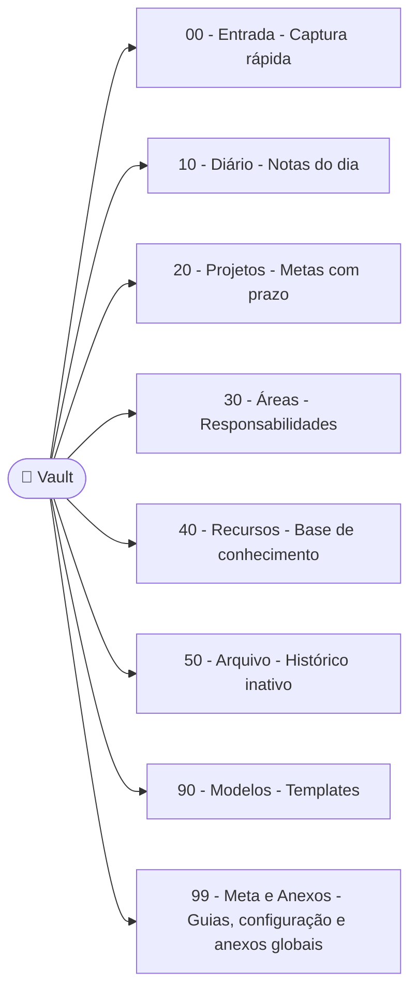

---
title: Entendendo a Estrutura de Pastas
aliases:
  - Estrutura de Pastas
  - Organização do Vault
tags:
  - meta/estrutura
  - meta/organizacao
  - iniciante
status: draft
created: 2023-10-27
updated: 2023-10-27
category: guia
audience: iniciante
sidebar:
  order: 5
related:
  - "[[Guia do Jardineiro Digital]]"
  - "[[Seus Primeiros Passos]]"
  - "[[Links]]"
  - "[[O que são MOCs (Mapas de Conteúdo)]]"
  - "[[Daily Note]]"
  - "[[Templater]]"
---
# Entendendo a Estrutura de Pastas

A ideia é começar com poucas pastas de alto nível, numeradas para manter a ordem visual no explorador de arquivos. A maior parte da organização virá de [[Links]], #tags e [[O que são MOCs (Mapas de Conteúdo)]].

## Estrutura Base

<!-- {=para-structure} -->

<!-- {/para-structure} -->

## Explicação dos Componentes

1.  **`.github/workflows/`**: Pasta para automações com GitHub Actions. É aqui que a 'mágica' acontece quando você envia suas notas para o GitHub com o `git push`.
    - `ci.yml`: Um workflow inicial pode simplesmente garantir que o push funcione ou, futuramente, rodar um linter de Markdown, ou até publicar o vault.
2.  **`00 - Entrada/`**: Essencial para capturar ideias rapidamente sem se preocupar onde colocá-las. Processe regularmente.
3.  **`10 - Diário/`**: Ideal para o [[Daily Note]] e pensamentos passageiros. Ótimo lugar para usar templates com o [[Templater]].
4.  **`20 - Projetos/`**: Foco em coisas acionáveis. Cada projeto pode ter sua própria subpasta se necessário, mas muitas vezes apenas uma nota principal, como `Projeto Alpha MOC.md`, linkando para outras notas relacionadas é suficiente.
5.  **`30 - Áreas/`**: Mantém o controle de padrões e responsabilidades contínuas. Menos volátil que projetos.
6.  **`40 - Recursos/`**: O coração do seu Second Brain. Aqui as notas devem ser atômicas e densamente interligadas (`[[Links]]`). A organização pode começar plana e evoluir com subpastas ou [[O que são MOCs (Mapas de Conteúdo)]].
7.  **`50 - Arquivo/`**: Mantém o vault principal focado no que é ativo ou relevante, sem perder o histórico.
8.  **`90 - Modelos/`**: Centraliza os modelos de notas.
9. **`99 - Meta e Anexos/`**: Guias, convenções e configuração do vault. A subpasta `Anexos/` é o **repositório global para todos os anexos do vault** — imagens e arquivos inseridos em qualquer nota, independente da pasta onde a nota está, são armazenados aqui.
    - `Manual do Vault.md`: Uma nota interna explicando as convenções do vault, estrutura, como usar tags, etc. É o manual interno do vault.
    - O Obsidian já vem pré-configurado para salvar todos os anexos em `99 - Meta e Anexos/Anexos/`. Para alterar, vá em `Settings > Files & Links > Default location for new attachments`.

## Distinção entre `docs/` e `99 - Meta e Anexos/`

Para manter a clareza na organização da documentação, é importante entender a diferença entre as pastas `docs/` e `99 - Meta e Anexos/`.

*   **`docs/` (Documentação Técnica/Operacional do Projeto)**:
    *   **Propósito**: Contém a documentação mais formal, técnica ou operacional sobre o *funcionamento do repositório/projeto em si*. São guias sobre como as ferramentas subjacentes funcionam (Git, GitHub Actions, etc.), como configurar o ambiente, ou detalhes sobre processos técnicos específicos.
    *   **Analogia**: Pense nisso como o **manual de instruções do carro**. Ele explica como o motor funciona, como trocar um pneu, ou como usar o sistema de navegação. É sobre as *partes técnicas e operacionais* do carro.

*   **`99 - Meta e Anexos/` (Meta-Documentação e Boas Práticas do Vault)**:
    *   **Propósito**: Contém a documentação sobre a *filosofia, as convenções, as boas práticas e o "como usar" o vault como sistema de gestão de conhecimento*. É sobre a experiência de uso do vault, suas regras internas, e anexos relacionados a essa meta-discussão.
    *   **Analogia**: Pense nisso como o **guia de direção defensiva e dicas de viagem**. Ele explica a *filosofia* de como dirigir com segurança, as *melhores rotas* para diferentes tipos de viagem, ou *como manter o carro limpo* para uma melhor experiência. É sobre a *experiência e as melhores práticas* de usar o carro, não sobre o funcionamento interno.

Essa distinção ajuda a manter a documentação organizada e fácil de navegar, direcionando o leitor para o tipo de informação que ele procura.

---
Voltar para o [[Guia do Jardineiro Digital]]
