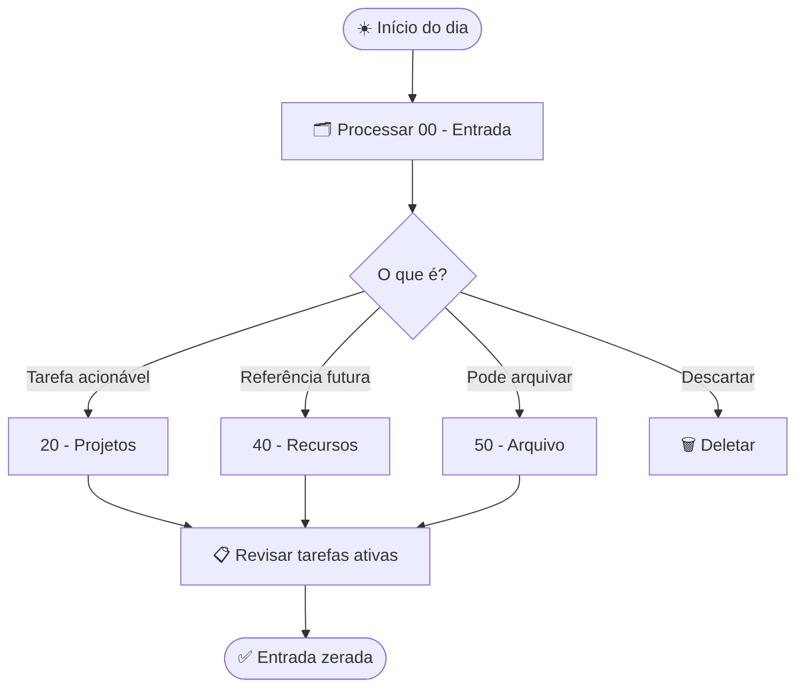

<!-- mdt template — edite este arquivo e rode `mdt update` para regenerar Exemplos.md -->

<!-- {@daily-review} -->

```mermaid
flowchart TD
    Start(["☀️ Início do dia"]) --> Inbox
    Inbox["🗂️ Processar 00 - Entrada"] --> Decide{"O que é?"}
    Decide -- "Tarefa acionável" --> Projetos["20 - Projetos"]
    Decide -- "Referência futura" --> Recursos["40 - Recursos"]
    Decide -- "Pode arquivar" --> Arquivo["50 - Arquivo"]
    Decide -- "Descartar" --> Lixo["🗑️ Deletar"]
    Projetos & Recursos & Arquivo --> Review["📋 Revisar tarefas ativas"]
    Review --> End(["✅ Entrada zerada"])
```
<!-- {/daily-review} -->
