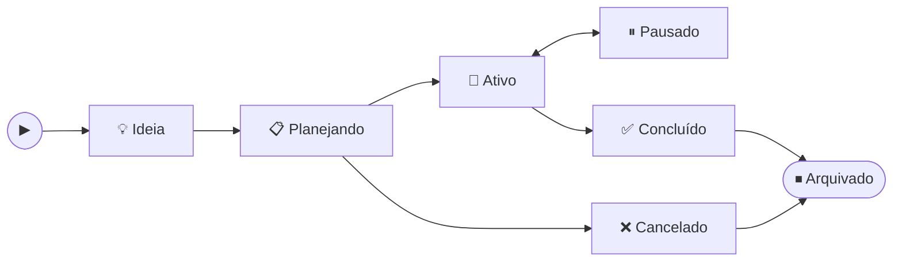

<!-- mdt template — edite este arquivo e rode `mdt update` para regenerar Exemplos.md -->

<!-- {@project-lifecycle} -->

```mermaid
flowchart LR
    S(["▶"]) --> Ideia["💡 Ideia"]
    Ideia --> Planejando["📋 Planejando"]
    Planejando --> Ativo["🚀 Ativo"]
    Ativo <--> Pausado["⏸ Pausado"]
    Ativo --> Concluido["✅ Concluído"]
    Concluido --> E(["⏹ Arquivado"])
    Planejando --> Cancelado["❌ Cancelado"]
    Cancelado --> E
```
<!-- {/project-lifecycle} -->
