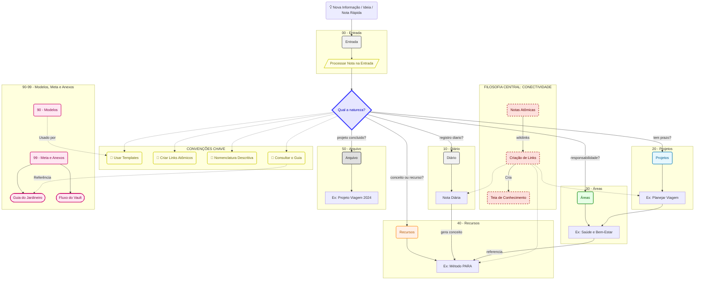
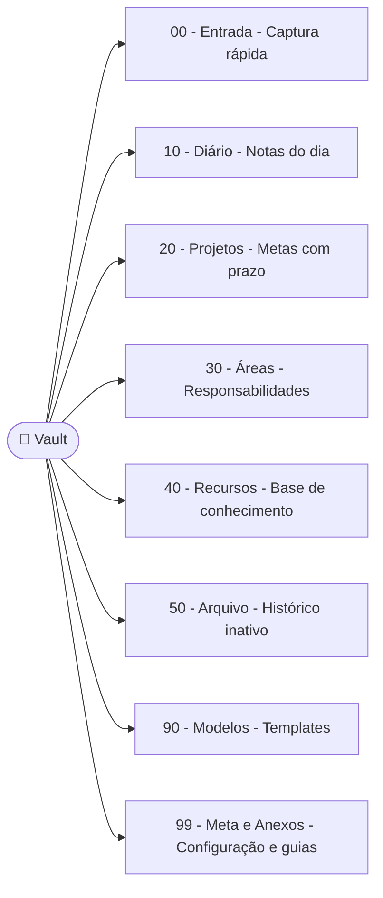
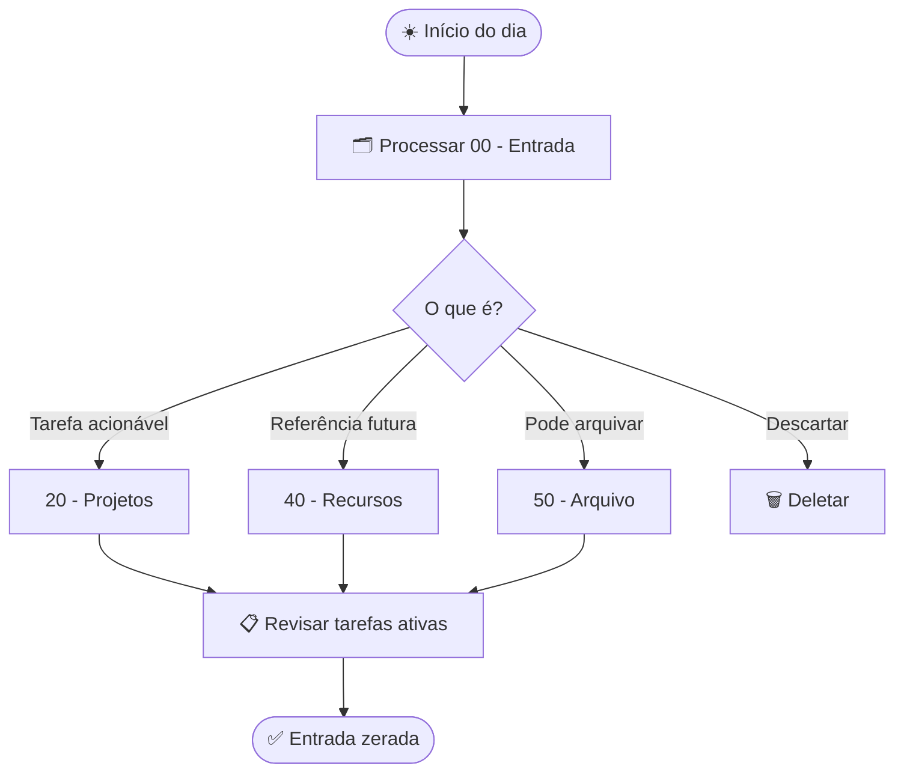
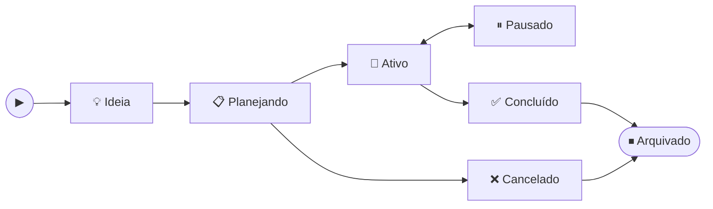

---
title: Diagramas do Vault
tags:
  - meta/diagramas
status: draft
category: referencia
audience: tecnico
---
# Diagramas do Vault

Para atualizar após editar um template, execute a partir desta pasta:

```bash
cd "99 - Meta e Anexos/Diagramas"
mdt update
```

## Fluxo do Vault

<!-- {=vault-flow} -->

<!-- {/vault-flow} -->

## Estrutura PARA

<!-- {=para-structure} -->

<!-- {/para-structure} -->

## Revisão Diária

<!-- {=daily-review} -->

<!-- {/daily-review} -->

## Ciclo de Vida de Projeto

<!-- {=project-lifecycle} -->

<!-- {/project-lifecycle} -->
