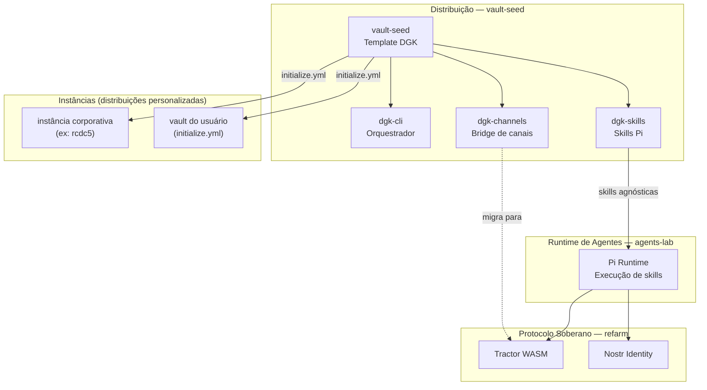

# Arquitetura e Ecossistema

Documento de referência sobre o posicionamento do vault-seed no ecossistema DGK,
as responsabilidades de cada projeto, e as decisões de design que guiam a evolução.

Para o diagrama visual de camadas, veja [`docs/diagrams/ECOSYSTEM.md`](diagrams/ECOSYSTEM.md).
Para o roadmap de versões, veja [`ROADMAP.md`](../ROADMAP.md).

---

## Posicionamento do vault-seed

Uma nota do vault pode ser uma unidade de publicação para múltiplos canais ao
mesmo tempo. O frontmatter controla o destino: site, RSS, Telegram, newsletter,
Mastodon, Bluesky, LinkedIn, GitHub — ou qualquer combinação. O Lab demonstra
esse fluxo com notebooks progressivos (WASM → local → CI/cloud).

vault-seed é a **superfície de distribuição** do ecossistema. Produz
*distribuições personalizadas*: cada fork/init é uma instância soberana com
identidade e conteúdo próprios.

---

## Ecossistema e divisão de responsabilidades

### vault-seed — interface e distribuição

- Estrutura PARA (Projects, Areas, Resources, Archive)
- Lab interativo (Marimo, 3-tier WASM/Local/CI)
- Outbox multi-canal (site, Mastodon, Bluesky, Telegram, newsletter, Instagram)
- Orquestrador CLI (`dgk etl`, `dgk outbox`, `dgk inbox`, `dgk lab`)
- Grafo semântico exportado em JSON-LD (`dgk:` namespace + schema.org)
- Governança editorial via manifesto `lab.notebooks.json`
- Skills Pi declarativas via `@aretw0/dgk-skills`

### agents-lab — runtime de agentes

Runtime Pi para execução de skills declarativas. Recebe do vault-seed apenas
o que é agnóstico do DGK e útil a qualquer projeto do ecossistema — as SKILL.md
são Markdown puro, portáteis por design.

### refarm — infraestrutura de identidade e protocolo

Microkernel WASM (Tractor), identidade autodeclarada via Nostr, CRDT (Loro)
para colaboração offline, contratos WIT para interoperabilidade polyglota.

Convergência com vault-seed: canal Nostr no outbox (v0.6.0), `@refarm.dev/rate-limiter`
e `@refarm.dev/contacts` substituindo o `@aretw0/dgk-channels` bridge (v0.7.0).

---

## Diagrama de camadas

<!-- {=dgk-ecosystem} -->

<!-- {/dgk-ecosystem} -->

---

## Caminho de convergência de engine

1. **Hoje:** `dgk-skills` declara `"pi": { "skills": [...] }` para o runtime Pi.
2. **v0.7.0:** adicionar `"refarm": { "skills": [...] }` ao mesmo `package.json`
   — as SKILL.md permanecem inalteradas (são Markdown puro).
3. **Longo prazo:** refarm como engine canônico; `"pi"` vira campo legado.
   Usuários não precisam saber que o refarm está por baixo — *powered by refarm*,
   de forma transparente.

`@aretw0/dgk-channels` é bridge temporário. Quando o refarm publicar equivalentes
(`rate-limiter`, `contacts`, `silo`), vault-seed migra para consumidor.

---

## IaC de Fontes — conceito v0.5.0

Hoje o ETL é um pipeline fixo de 4 scripts. A próxima evolução é tratar as
**fontes de dados como configuração declarada**, seguindo o mesmo princípio que
o rcdc5 aplica para scraping empresarial: uma fonte declarada gera um perfil de
ingestão que o pipeline executa automaticamente.

### `lab.sources.json` — configuração declarada

```json
[
  {
    "id": "feeds-rss",
    "type": "rss",
    "url": "feeds.opml",
    "target": "40 - Recursos/Leituras",
    "profile": "opml-reader"
  },
  {
    "id": "github-stars",
    "type": "github-stars",
    "url": "https://api.github.com/users/{user}/starred",
    "target": "40 - Recursos/Referências",
    "profile": "github-api"
  }
]
```

### `ExtractionProfile` — interface modular

Cada `type` mapeia para um perfil Python com interface padronizada:

```python
class ExtractionProfile(Protocol):
    def extract(self, source: dict) -> list[dict]: ...
    def transform(self, items: list[dict]) -> list[dict]: ...
    def load(self, items: list[dict], target: str) -> None: ...
```

`dgk etl` lê `lab.sources.json` e despacha cada entrada para o perfil registrado.
Adicionar uma nova fonte = um novo objeto JSON + um novo arquivo de perfil Python.

### Taxonomia e roteamento automático

O campo `target` pode usar roteamento semântico: se `target` for `"auto"`,
o classificador IA (`curadoria-feeds-ia.py`) determina a pasta PARA com base
no conteúdo. Isso espelha o sistema de taxonomia do rcdc5 (`rm-taxonomy`),
portado de forma agnóstica ao DGK.

### Cache bruto e staging

```
dados/lab/
├── cache/          # dados brutos por perfil (preservados entre runs)
├── staging/        # dados transformados antes do load
└── *.json          # snapshots finais (publicados no site)
```

Separar cache/staging permite reprocessar sem refazer o fetch — relevante para
fontes com rate limits (GitHub API, Telegram).

---

## Ciclo de vida dos dados do Lab

`dados/lab/` contém artefatos gerados pelo ETL — não é fonte de verdade, é
saída de pipeline. O padrão de versionamento segue essa distinção:

| Contexto | `dados/lab/` no git | Motivo |
|---|---|---|
| vault-seed (template) | **Rastreado** | Baseline de demo para notebooks WASM e site |
| Vault do usuário | **Gitignore** | Regenerável com `dgk etl`; varia com cada vault |

O `initialize.yml` remove `dados/lab/` do vault do usuário ao inicializar,
e o `.gitignore` herdado impede commits acidentais após o primeiro `dgk etl`.

### Quando migrar além do git

Git funciona bem para `dados/lab/` enquanto:
- O total de arquivos JSON cabe em ~1 MB.
- O ETL roda manualmente (não diariamente em CI).
- O número de notas indexadas fica abaixo de ~500.

Quando ultrapassar esses limites, as opções naturais são:

1. **SQLite local** (`dados/lab.db`) — `dgk etl` escreve no banco; notebooks
   leem via DuckDB ou `sqlite3`. Nenhum JSON no git; queries mais rápidas.
2. **Repositório de dados separado** — para vaults colaborativos onde o dado
   histórico importa. O vault-seed aponta para o repo de dados; CI sincroniza.
3. **Compactação por período** — arquivar snapshots mensais e manter apenas o
   JSON mais recente no git. Padrão adequado para vaults de longo prazo com
   histórico editorial relevante.

A regra prática: se `git log --follow dados/lab/` virar ruído em vez de sinal,
é hora de migrar.

---

## Princípios de design

1. **Cada notebook tem 3 blocos visuais:** "O que você vê agora" (WASM) →
   "O que você pode fazer localmente" → "O que a CI faz por você".
2. **Dados de exemplo são reais:** feeds reais, notas reais, outbox com itens reais.
3. **Todo feature tem teste:** contratos em `scripts/*.test.*` e `packages/cli/test/`.
4. **Nenhuma nota fica presa num canal:** o frontmatter decide onde ela vai.
5. **Soberania digital visível:** o usuário vê o dado sendo coletado, transformado
   e escrito de volta — sem caixas pretas.
6. **Distribuições personalizadas, não instâncias gerenciadas:** o vault do usuário
   é seu, não um serviço controlado pelo template.
7. **CLI agnóstico de package manager:** `dgk etl` chama `node` diretamente,
   não `pnpm run` — funciona em qualquer ambiente com Node.js.

---

## Vocabulário canônico

Termos usados na documentação, apresentações e textos técnicos:

| Conceito técnico | Expressão canônica |
|---|---|
| vault-seed + packages | "arcabouço modular" |
| fork via `initialize.yml` | "distribuição personalizada" |
| local-first, formato aberto | "soberania de dados" |
| o vault em si (Markdown + PARA) | "caixa de notas" |
| `grafo-do-vault.jsonld` | "grafo semântico" |
| Lab ETL pipeline (`dgk etl`) | "ingestão modular" |
| `dgk-cli` | "orquestrador" |
| `lab.notebooks.json` + CI | "governança editorial" |
| estrutura mínima + módulos opcionais | "microkernel para conhecimento" |
