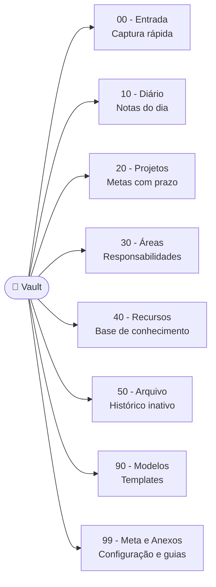

<!-- mdt template — run `mdt update` from repo root to sync, `mdt check` in CI -->

<!-- {@para-structure} -->

```mermaid
graph LR
    Vault(["🌱 Vault"])
    Vault --> E["00 - Entrada\nCaptura rápida"]
    Vault --> D["10 - Diário\nNotas do dia"]
    Vault --> P["20 - Projetos\nMetas com prazo"]
    Vault --> A["30 - Áreas\nResponsabilidades"]
    Vault --> R["40 - Recursos\nBase de conhecimento"]
    Vault --> Arq["50 - Arquivo\nHistórico inativo"]
    Vault --> M["90 - Modelos\nTemplates"]
    Vault --> Meta["99 - Meta e Anexos\nConfiguração e guias"]
```
<!-- {/para-structure} -->
