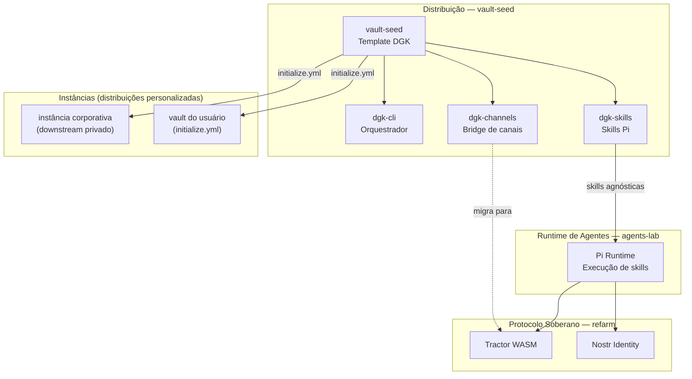

# Ecossistema DGK

Mapa das camadas do ecossistema e como cada projeto se relaciona. Para contexto
estratégico completo, veja [`docs/ARCHITECTURE.md`](../ARCHITECTURE.md).

Para atualizar após editar o template, execute a partir da raiz do projeto:

```bash
mdt update
```

## Camadas do Ecossistema

<!-- {=dgk-ecosystem} -->

<!-- {/dgk-ecosystem} -->
