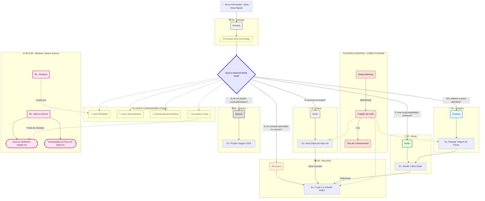
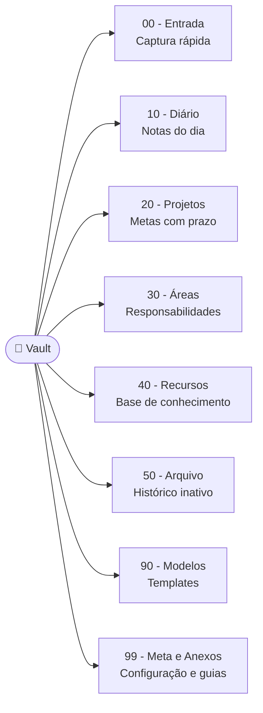
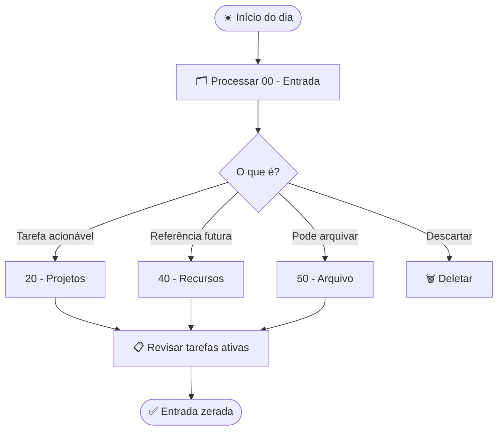
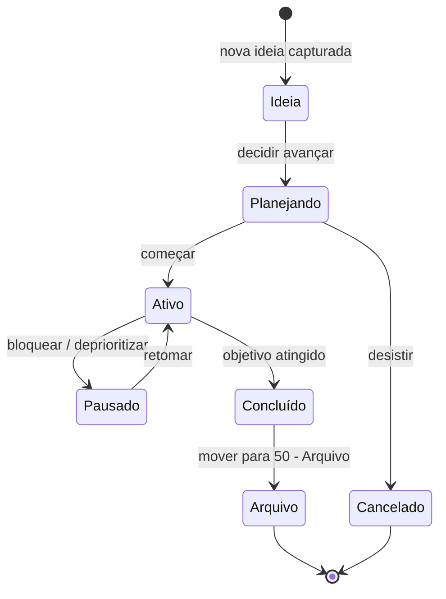

# mdt — Diagramas Mermaid Gerenciados por Template — Implementation Plan

> **For agentic workers:** REQUIRED SUB-SKILL: Use superpowers:subagent-driven-development (recommended) or superpowers:executing-plans to implement this plan task-by-task. Steps use checkbox (`- [ ]`) syntax for tracking.

**Goal:** Integrar `mdt_cli` para manter diagramas Mermaid inline nos guias do vault via templates versionados, entregando ao usuário um kit inicial para criar e manter os próprios diagramas.

**Architecture:** Dois setups mdt independentes — (1) raiz do repo com `mdt.toml`, templates em `docs/diagrams/.templates/`, alvos nos `.md` do vault; CI valida com `mdt check` — (2) `99 - Meta e Anexos/Diagramas/` com `mdt.toml` próprio, kit do usuário, fora do escopo do CI.

**Tech Stack:** mdt_cli 0.7.0 (Rust/Cargo), Mermaid inline em Markdown, GitHub Actions

---

## Pré-requisito

**OBRIGATÓRIO:** implementar primeiro o plano `2026-05-19-renomear-pastas-pt-br-e-migrar-changesets.md`. Todos os paths usam os nomes PT-BR (`99 - Meta e Anexos/`, `90 - Modelos/`, etc.).

Verificar que as pastas PT-BR existem antes de começar:

```bash
ls "99 - Meta e Anexos/"
# Deve listar: Visualização do Fluxo do Vault.md, Entendendo a Estrutura de Pastas.md, ...
```

## Instalar mdt_cli localmente

Antes de qualquer task, instalar o binário (requer Rust/Cargo):

```bash
cargo install mdt_cli --locked --version 0.7.0
mdt --version
# Expected: mdt 0.7.0
```

Se não tiver Rust: `curl --proto '=https' --tlsv1.2 -sSf https://sh.rustup.rs | sh`

---

## Mapa de arquivos

| Arquivo | Ação | Responsabilidade |
|---|---|---|
| `.devcontainer/post-create.sh` | Modificar | Instala mdt_cli no devcontainer |
| `mdt.toml` | Criar | Config raiz — define padding para templates |
| `docs/diagrams/.templates/vault-flow.t.md` | Criar | Template do flowchart PKM com nomes PT-BR |
| `docs/diagrams/.templates/para-structure.t.md` | Criar | Template da estrutura PARA (graph LR) |
| `99 - Meta e Anexos/Visualização do Fluxo do Vault.md` | Modificar | Substitui bloco Mermaid por marcadores de injeção |
| `99 - Meta e Anexos/Entendendo a Estrutura de Pastas.md` | Modificar | Substitui árvore de texto por marcadores de injeção |
| `package.json` | Modificar | Adiciona scripts `diagrams:update` e `diagrams:check` |
| `.github/workflows/validate-mdt.yml` | Criar | CI: `mdt check` em PR/push |
| `99 - Meta e Anexos/Diagramas/mdt.toml` | Criar | Config do kit do usuário |
| `99 - Meta e Anexos/Diagramas/.templates/vault-flow.t.md` | Criar | Cópia de referência |
| `99 - Meta e Anexos/Diagramas/.templates/para-structure.t.md` | Criar | Cópia de referência |
| `99 - Meta e Anexos/Diagramas/.templates/daily-review.t.md` | Criar | Starter pessoal — revisão diária |
| `99 - Meta e Anexos/Diagramas/.templates/project-lifecycle.t.md` | Criar | Starter pessoal — ciclo de vida de projeto |
| `99 - Meta e Anexos/Diagramas/Exemplos.md` | Criar | Alvo pré-injetado com os 4 blocos |
| `docs/compatibilidade-de-ambiente-e-setup.md` | Modificar | Adiciona seção de instalação do mdt_cli |

---

### Task 1: Devcontainer — instalar mdt_cli

**Files:**
- Modify: `.devcontainer/post-create.sh`

- [ ] **Step 1: Adicionar `cargo install mdt_cli` no post-create.sh, antes do readiness gate**

O arquivo termina com o bloco "Readiness gate". Inserir o trecho abaixo logo antes do `echo ""` final:

```bash
# mdt_cli — gerenciador de templates de diagramas Mermaid
cargo install mdt_cli --locked --version 0.7.0 \
  || echo "[aviso] mdt_cli install falhou. Execute: cargo install mdt_cli --locked --version 0.7.0"
```

O trecho final do arquivo após a edição:

```bash
# mdt_cli — gerenciador de templates de diagramas Mermaid
cargo install mdt_cli --locked --version 0.7.0 \
  || echo "[aviso] mdt_cli install falhou. Execute: cargo install mdt_cli --locked --version 0.7.0"

# Readiness gate — confirma que todas as ferramentas estão disponíveis
echo ""
echo "=== Ambiente pronto ==="
echo "Node.js : $(node -v)"
echo "pnpm    : $(pnpm --version)"
echo "uv      : $(uv --version)"
echo "Pi      : $(pi --version 2>/dev/null || echo 'não instalado')"
echo "======================="
```

- [ ] **Step 2: Verificar que a linha foi inserida no lugar certo**

```bash
grep -n "mdt_cli" .devcontainer/post-create.sh
```

Expected: linha com `cargo install mdt_cli` antes da linha com `echo "=== Ambiente pronto ==="`.

- [ ] **Step 3: Commit**

```bash
git add .devcontainer/post-create.sh
git commit -m "feat(devcontainer): install mdt_cli for Mermaid template management"
```

---

### Task 2: Config raiz — `mdt.toml` e estrutura de diretórios

**Files:**
- Create: `mdt.toml`
- Create: `docs/diagrams/.templates/` (diretório — criado implicitamente ao criar os templates)

O `mdt.toml` na raiz faz mdt escanear recursivamente todo o repo. Templates em `docs/diagrams/.templates/*.t.md` e alvos em `99 - Meta e Anexos/*.md` são encontrados pelo mesmo scan.

- [ ] **Step 1: Criar `mdt.toml` na raiz**

```toml
[padding]
before = 0
after = 0
```

- [ ] **Step 2: Verificar que mdt reconhece o arquivo**

```bash
mdt --version
# Expected: mdt 0.7.0
cat mdt.toml
# Expected: os dois campos de padding
```

- [ ] **Step 3: Commit**

```bash
git add mdt.toml
git commit -m "feat(mdt): add root mdt.toml config"
```

---

### Task 3: Template `vault-flow.t.md`

**Files:**
- Create: `docs/diagrams/.templates/vault-flow.t.md`

Migra o flowchart existente de `99 - Meta e Anexos/Visualização do Fluxo do Vault.md` com nomes de pasta atualizados para PT-BR.

- [ ] **Step 1: Criar `docs/diagrams/.templates/vault-flow.t.md`**

```markdown
<!-- mdt template — run `mdt update` from repo root to sync, `mdt check` in CI -->

<!-- {@vault-flow} -->

<!-- {/vault-flow} -->
```

- [ ] **Step 2: Verificar que o bloco nomeado está correto**

```bash
grep -n "vault-flow" "docs/diagrams/.templates/vault-flow.t.md"
```

Expected:
```
3:<!-- {@vault-flow} -->
N:<!-- {/vault-flow} -->
```

- [ ] **Step 3: Commit**

```bash
git add "docs/diagrams/.templates/vault-flow.t.md"
git commit -m "feat(mdt): add vault-flow Mermaid template with PT-BR folder names"
```

---

### Task 4: Template `para-structure.t.md`

**Files:**
- Create: `docs/diagrams/.templates/para-structure.t.md`

Novo diagrama mostrando as 8 pastas do vault e seus propósitos em um `graph LR`.

- [ ] **Step 1: Criar `docs/diagrams/.templates/para-structure.t.md`**

```markdown
<!-- mdt template — run `mdt update` from repo root to sync, `mdt check` in CI -->

<!-- {@para-structure} -->

<!-- {/para-structure} -->
```

- [ ] **Step 2: Verificar que o bloco está correto**

```bash
grep -n "para-structure" "docs/diagrams/.templates/para-structure.t.md"
```

Expected:
```
3:<!-- {@para-structure} -->
N:<!-- {/para-structure} -->
```

- [ ] **Step 3: Commit**

```bash
git add "docs/diagrams/.templates/para-structure.t.md"
git commit -m "feat(mdt): add para-structure Mermaid template"
```

---

### Task 5: Marcadores de injeção — `Visualização do Fluxo do Vault.md`

**Files:**
- Modify: `99 - Meta e Anexos/Visualização do Fluxo do Vault.md`

Substitui o bloco Mermaid inline existente pelos marcadores de injeção mdt. O diagrama passa a ser gerenciado pelo template `vault-flow.t.md`.

- [ ] **Step 1: Localizar o bloco Mermaid no arquivo alvo**

```bash
grep -n "mermaid\|vault-flow" "99 - Meta e Anexos/Visualização do Fluxo do Vault.md"
```

Expected: linha com ` ```mermaid` e linha com ` ``` ` de fechamento (o bloco inteiro).

- [ ] **Step 2: Substituir o bloco Mermaid pelos marcadores**

Localizar a seção que começa em `# Visualização do Fluxo do Vault` e contém o parágrafo introdutório seguido do bloco mermaid. Substituir **apenas** o bloco mermaid (de ` ```mermaid` até o ` ``` ` de fechamento) pelos marcadores abaixo, mantendo o parágrafo introdutório intacto:

```markdown
<!-- {=vault-flow} -->
<!-- {/vault-flow} -->
```

O arquivo após a edição deve ter esta estrutura:

```markdown
# Visualização do Fluxo do Vault

Para uma representação visual da estrutura de pastas e das conexões entre as notas, você pode visualizar o mapa mental do vault.

<!-- {=vault-flow} -->
<!-- {/vault-flow} -->

---
Voltar para o [[Guia do Jardineiro Digital]]
```

- [ ] **Step 3: Verificar que o bloco mermaid antigo foi removido e os marcadores estão presentes**

```bash
grep -c "mermaid" "99 - Meta e Anexos/Visualização do Fluxo do Vault.md"
# Expected: 0

grep "vault-flow" "99 - Meta e Anexos/Visualização do Fluxo do Vault.md"
# Expected:
# <!-- {=vault-flow} -->
# <!-- {/vault-flow} -->
```

- [ ] **Step 4: Verificar que mdt check detecta dessincronização (smoke test — deve FALHAR)**

```bash
mdt check
# Expected: erro indicando que vault-flow está fora de sync (marcadores vazios vs template com conteúdo)
# Exit code != 0
```

- [ ] **Step 5: Commit**

```bash
git add "99 - Meta e Anexos/Visualização do Fluxo do Vault.md"
git commit -m "refactor(vault): replace inline Mermaid with mdt injection markers in vault-flow guide"
```

---

### Task 6: Marcadores de injeção — `Entendendo a Estrutura de Pastas.md`

**Files:**
- Modify: `99 - Meta e Anexos/Entendendo a Estrutura de Pastas.md`

Substitui a árvore de texto em `## Estrutura Base` pelos marcadores de injeção para o template `para-structure`.

- [ ] **Step 1: Localizar a seção `## Estrutura Base` no arquivo**

```bash
grep -n "Estrutura Base\|para-structure" "99 - Meta e Anexos/Entendendo a Estrutura de Pastas.md"
```

Expected: linha com `## Estrutura Base` e sem nenhuma referência a `para-structure` ainda.

- [ ] **Step 2: Substituir o bloco de código da árvore pelos marcadores**

A seção `## Estrutura Base` contém um bloco ` ```...``` ` com a árvore de diretórios. Substituir **todo o bloco** (do ` ``` ` de abertura até o ` ``` ` de fechamento) pelos marcadores abaixo, mantendo o heading `## Estrutura Base`:

```markdown
## Estrutura Base

<!-- {=para-structure} -->
<!-- {/para-structure} -->
```

- [ ] **Step 3: Verificar que os marcadores estão presentes e a árvore de texto foi removida**

```bash
grep -A3 "Estrutura Base" "99 - Meta e Anexos/Entendendo a Estrutura de Pastas.md"
```

Expected:
```
## Estrutura Base

<!-- {=para-structure} -->
<!-- {/para-structure} -->
```

- [ ] **Step 4: Commit**

```bash
git add "99 - Meta e Anexos/Entendendo a Estrutura de Pastas.md"
git commit -m "refactor(vault): replace text tree with mdt injection markers in folder structure guide"
```

---

### Task 7: `mdt update` — sincronizar templates nos alvos

Rodar `mdt update` a partir da raiz para injetar os templates nos dois arquivos alvo. Este é o gate de validação intermediário.

- [ ] **Step 1: Rodar `mdt update` da raiz**

```bash
mdt update
```

Expected: saída mostrando que `vault-flow` e `para-structure` foram injetados nos arquivos alvo. Sem erros.

- [ ] **Step 2: Verificar que os marcadores agora têm conteúdo**

```bash
grep -A5 "vault-flow" "99 - Meta e Anexos/Visualização do Fluxo do Vault.md" | head -10
```

Expected: marcadores com o bloco Mermaid injetado entre `<!-- {=vault-flow} -->` e `<!-- {/vault-flow} -->`.

```bash
grep -A5 "para-structure" "99 - Meta e Anexos/Entendendo a Estrutura de Pastas.md" | head -10
```

Expected: marcadores com o `graph LR` injetado.

- [ ] **Step 3: Verificar que `mdt check` passa**

```bash
mdt check
# Expected: saída indicando que todos os blocos estão em sync
# Exit code 0
```

- [ ] **Step 4: Commit dos arquivos alvo com conteúdo injetado**

```bash
git add "99 - Meta e Anexos/Visualização do Fluxo do Vault.md" \
        "99 - Meta e Anexos/Entendendo a Estrutura de Pastas.md"
git commit -m "feat(vault): inject mdt Mermaid diagrams into vault guides"
```

---

### Task 8: Scripts em `package.json`

**Files:**
- Modify: `package.json`

- [ ] **Step 1: Adicionar scripts `diagrams:update` e `diagrams:check` na seção `scripts`**

Adicionar após o script `validate:onboarding` (antes de `validate`):

```json
"diagrams:update": "mdt update",
"diagrams:check": "mdt check",
```

A seção `scripts` após a edição deve conter:

```json
"validate:onboarding": "node scripts/validate_onboarding.js",
"diagrams:update": "mdt update",
"diagrams:check": "mdt check",
"validate": "pnpm run lint && pnpm run test && pnpm run validate:onboarding && pnpm run smoke:template",
```

Nota: `diagrams:check` **não entra** no script `validate` — mdt é opcional localmente (requer Rust). A validação de diagrams é feita pelo CI separado `validate-mdt.yml`.

- [ ] **Step 2: Verificar que os scripts foram adicionados**

```bash
node -e "const p = require('./package.json'); console.log(p.scripts['diagrams:update'], p.scripts['diagrams:check'])"
```

Expected: `mdt update  mdt check`

- [ ] **Step 3: Rodar `pnpm run diagrams:check` para confirmar que funciona**

```bash
pnpm run diagrams:check
# Expected: exit 0, sem erros de sync
```

- [ ] **Step 4: Commit**

```bash
git add package.json
git commit -m "feat(scripts): add diagrams:update and diagrams:check npm scripts"
```

---

### Task 9: CI workflow `validate-mdt.yml`

**Files:**
- Create: `.github/workflows/validate-mdt.yml`

**Nota:** A action `actions/cache` usa hash `5a3ec84eff668545956fd18022155c47e93e2684` (v4.2.3 conforme spec). Verificar o hash atual em https://github.com/actions/cache/releases antes de fazer o merge — use o hash da release mais recente v4.x.

- [ ] **Step 1: Criar `.github/workflows/validate-mdt.yml`**

```yaml
name: Validate MDT Diagrams

on:
  pull_request:
    branches: [main, develop]
    paths:
      - "docs/diagrams/.templates/**"
      - "mdt.toml"
      - "99 - Meta e Anexos/Visualização do Fluxo do Vault.md"
      - "99 - Meta e Anexos/Entendendo a Estrutura de Pastas.md"
      - ".github/workflows/validate-mdt.yml"
  push:
    branches: [main]
    paths:
      - "docs/diagrams/.templates/**"
      - "mdt.toml"
  workflow_dispatch:
  schedule:
    - cron: "0 14 * * 3"

permissions:
  contents: read

jobs:
  validate:
    name: Check MDT diagram sync
    runs-on: ubuntu-latest
    timeout-minutes: 15

    steps:
      - name: Checkout
        uses: actions/checkout@de0fac2e4500dabe0009e67214ff5f5447ce83dd # v6.0.2

      - name: Cache mdt_cli
        id: cache-mdt
        uses: actions/cache@5a3ec84eff668545956fd18022155c47e93e2684 # v4.2.3
        with:
          path: ~/.cargo/bin/mdt
          key: ${{ runner.os }}-mdt-cli-0.7.0

      - name: Install mdt_cli
        if: steps.cache-mdt.outputs.cache-hit != 'true'
        run: cargo install mdt_cli --locked --version 0.7.0

      - name: Check MDT sync — vault diagrams
        run: mdt check
```

- [ ] **Step 2: Verificar que o YAML é válido**

```bash
python3 -c "import yaml; yaml.safe_load(open('.github/workflows/validate-mdt.yml'))" && echo "YAML válido"
# Expected: YAML válido
```

- [ ] **Step 3: Verificar estrutura do workflow**

```bash
grep -E "name:|uses:|run:" .github/workflows/validate-mdt.yml
```

Expected: 4 steps — Checkout, Cache mdt_cli, Install mdt_cli, Check MDT sync.

- [ ] **Step 4: Commit**

```bash
git add .github/workflows/validate-mdt.yml
git commit -m "ci: add validate-mdt workflow for Mermaid diagram sync"
```

---

### Task 10: Kit do usuário — `99 - Meta e Anexos/Diagramas/`

**Files:**
- Create: `99 - Meta e Anexos/Diagramas/mdt.toml`
- Create: `99 - Meta e Anexos/Diagramas/.templates/vault-flow.t.md`
- Create: `99 - Meta e Anexos/Diagramas/.templates/para-structure.t.md`
- Create: `99 - Meta e Anexos/Diagramas/.templates/daily-review.t.md`
- Create: `99 - Meta e Anexos/Diagramas/.templates/project-lifecycle.t.md`
- Create: `99 - Meta e Anexos/Diagramas/Exemplos.md`

Este setup é completamente independente da raiz. O usuário roda `mdt update` a partir de `99 - Meta e Anexos/Diagramas/` para regenerar `Exemplos.md`.

- [ ] **Step 1: Criar `99 - Meta e Anexos/Diagramas/mdt.toml`**

```toml
[padding]
before = 0
after = 0
```

- [ ] **Step 2: Criar cópia de referência `vault-flow.t.md` no kit**

Conteúdo idêntico ao de `docs/diagrams/.templates/vault-flow.t.md` (copiar):

```bash
cp "docs/diagrams/.templates/vault-flow.t.md" \
   "99 - Meta e Anexos/Diagramas/.templates/vault-flow.t.md"
```

- [ ] **Step 3: Criar cópia de referência `para-structure.t.md` no kit**

```bash
cp "docs/diagrams/.templates/para-structure.t.md" \
   "99 - Meta e Anexos/Diagramas/.templates/para-structure.t.md"
```

- [ ] **Step 4: Criar `daily-review.t.md`**

```markdown
<!-- mdt template — edite este arquivo e rode `mdt update` para regenerar Exemplos.md -->

<!-- {@daily-review} -->

<!-- {/daily-review} -->
```

- [ ] **Step 5: Criar `project-lifecycle.t.md`**

```markdown
<!-- mdt template — edite este arquivo e rode `mdt update` para regenerar Exemplos.md -->

<!-- {@project-lifecycle} -->

<!-- {/project-lifecycle} -->
```

- [ ] **Step 6: Criar `Exemplos.md` com marcadores pré-injetados**

Criar o arquivo com o comando abaixo (usa heredoc para evitar problema de backticks aninhados):

```bash
cat > "99 - Meta e Anexos/Diagramas/Exemplos.md" << 'ENDOFFILE'
---
title: Diagramas do Vault
tags:
  - meta/diagramas
status: published
---
# Diagramas do Vault

Para atualizar após editar um template, execute a partir desta pasta:

    cd "99 - Meta e Anexos/Diagramas"
    mdt update

## Fluxo do Vault
<!-- {=vault-flow} -->
<!-- {/vault-flow} -->

## Estrutura PARA
<!-- {=para-structure} -->
<!-- {/para-structure} -->

## Revisão Diária
<!-- {=daily-review} -->
<!-- {/daily-review} -->

## Ciclo de Vida de Projeto
<!-- {=project-lifecycle} -->
<!-- {/project-lifecycle} -->
ENDOFFILE
```

Nota: o bloco de instrução de uso usa indentação de 4 espaços (código sem fences) para evitar conflito com o heredoc. Após `mdt update`, os marcadores receberão o conteúdo dos diagramas.

- [ ] **Step 7: Verificar que mdt check detecta dessincronização no kit (deve FALHAR — marcadores ainda vazios)**

Todos os comandos a seguir são executados a partir da **raiz do repo**:

```bash
(cd "99 - Meta e Anexos/Diagramas" && mdt check)
# Expected: erro de sync (Exemplos.md tem marcadores vazios mas templates têm conteúdo)
# Exit code != 0
```

- [ ] **Step 8: Rodar `mdt update` no kit para injetar os templates**

```bash
(cd "99 - Meta e Anexos/Diagramas" && mdt update)
# Expected: Exemplos.md atualizado com os 4 diagramas injetados
```

- [ ] **Step 9: Verificar que `mdt check` passa no kit**

```bash
(cd "99 - Meta e Anexos/Diagramas" && mdt check)
# Expected: exit 0
```

- [ ] **Step 10: Commit do kit completo (a partir da raiz do repo)**

```bash
git add "99 - Meta e Anexos/Diagramas/"
git commit -m "feat(vault): add user diagram kit with mdt templates and Exemplos.md"
```

---

### Task 11: Documentação local

**Files:**
- Modify: `docs/compatibilidade-de-ambiente-e-setup.md`

- [ ] **Step 1: Adicionar seção sobre mdt_cli ao final do arquivo (antes do último heading de nível 2 se houver, ou ao final)**

```markdown
## mdt — Gerenciador de Templates de Diagramas

Instale via Cargo (requer Rust):

```bash
cargo install mdt_cli --locked --version 0.7.0
```

Para atualizar os diagramas do vault após editar um template:

```bash
# Diagramas dos guias (raiz do repo):
mdt update

# Kit pessoal:
cd "99 - Meta e Anexos/Diagramas" && mdt update
```

Para verificar que nenhum diagrama está dessincronizado:

```bash
# Raiz do repo:
mdt check

# Kit pessoal:
cd "99 - Meta e Anexos/Diagramas" && mdt check
```
```

- [ ] **Step 2: Verificar que a seção foi adicionada**

```bash
grep -n "mdt" docs/compatibilidade-de-ambiente-e-setup.md
```

Expected: linhas com `mdt_cli`, `mdt update`, `mdt check`.

- [ ] **Step 3: Commit**

```bash
git add docs/compatibilidade-de-ambiente-e-setup.md
git commit -m "docs: add mdt_cli setup instructions to environment setup guide"
```

---

### Task 12: Validação final (gate)

Verifica que todo o setup está coerente: templates, alvos, CI, e que o pipeline de validação existente não foi quebrado.

- [ ] **Step 1: `mdt check` na raiz — verifica sync dos guias do vault**

```bash
mdt check
# Expected: exit 0, sem erros
```

- [ ] **Step 2: `mdt check` no kit do usuário — verifica sync do Exemplos.md**

```bash
cd "99 - Meta e Anexos/Diagramas" && mdt check && cd ../..
# Expected: exit 0
```

- [ ] **Step 3: Verificar que nenhuma referência antiga ao nome inglês sobrou nos templates**

```bash
grep -rn "00 - Entrada\|10 - Fleeting\|40 - Recursos\|50 - Arquivo\|90 - Modelos\|99 - Meta e Anexos" \
  docs/diagrams/.templates/ "99 - Meta e Anexos/Diagramas/.templates/"
# Expected: nenhuma linha — todos os nomes devem ser PT-BR
```

- [ ] **Step 4: Rodar `pnpm run validate` para garantir que o pipeline principal não foi quebrado**

```bash
pnpm run validate
# Expected: lint + tests + validate:onboarding + smoke:template — todos passando
```

- [ ] **Step 5: Verificar que os arquivos do CI estão presentes e o YAML é válido**

```bash
python3 -c "
import yaml, sys
files = [
  '.github/workflows/validate-mdt.yml',
  '.github/workflows/template-ci.yml',
]
for f in files:
    yaml.safe_load(open(f))
    print(f'OK: {f}')
"
# Expected:
# OK: .github/workflows/validate-mdt.yml
# OK: .github/workflows/template-ci.yml
```

- [ ] **Step 6: Verificar que os scripts de package.json estão presentes**

```bash
node -e "
const p = require('./package.json');
const required = ['diagrams:update', 'diagrams:check', 'validate'];
required.forEach(s => {
  if (!p.scripts[s]) { console.error('FALTANDO:', s); process.exit(1); }
  console.log('OK:', s, '->', p.scripts[s]);
});
"
# Expected:
# OK: diagrams:update -> mdt update
# OK: diagrams:check -> mdt check
# OK: validate -> pnpm run lint && ...
```

- [ ] **Step 7: Verificar estrutura de arquivos final**

```bash
ls mdt.toml \
   "docs/diagrams/.templates/vault-flow.t.md" \
   "docs/diagrams/.templates/para-structure.t.md" \
   ".github/workflows/validate-mdt.yml" \
   "99 - Meta e Anexos/Diagramas/mdt.toml" \
   "99 - Meta e Anexos/Diagramas/Exemplos.md"
# Expected: todos os 6 arquivos listados sem erros
```

- [ ] **Step 8: Commit final (se houver algo não commitado) e push**

```bash
git status
# Expected: nothing to commit

git push origin develop
```
