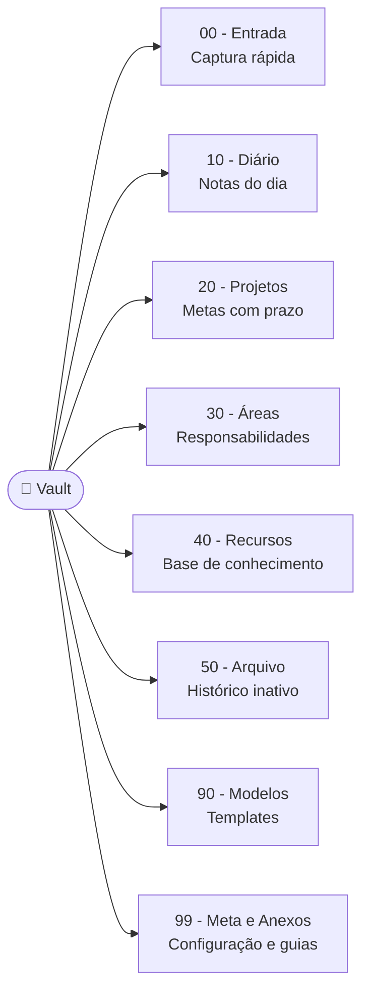
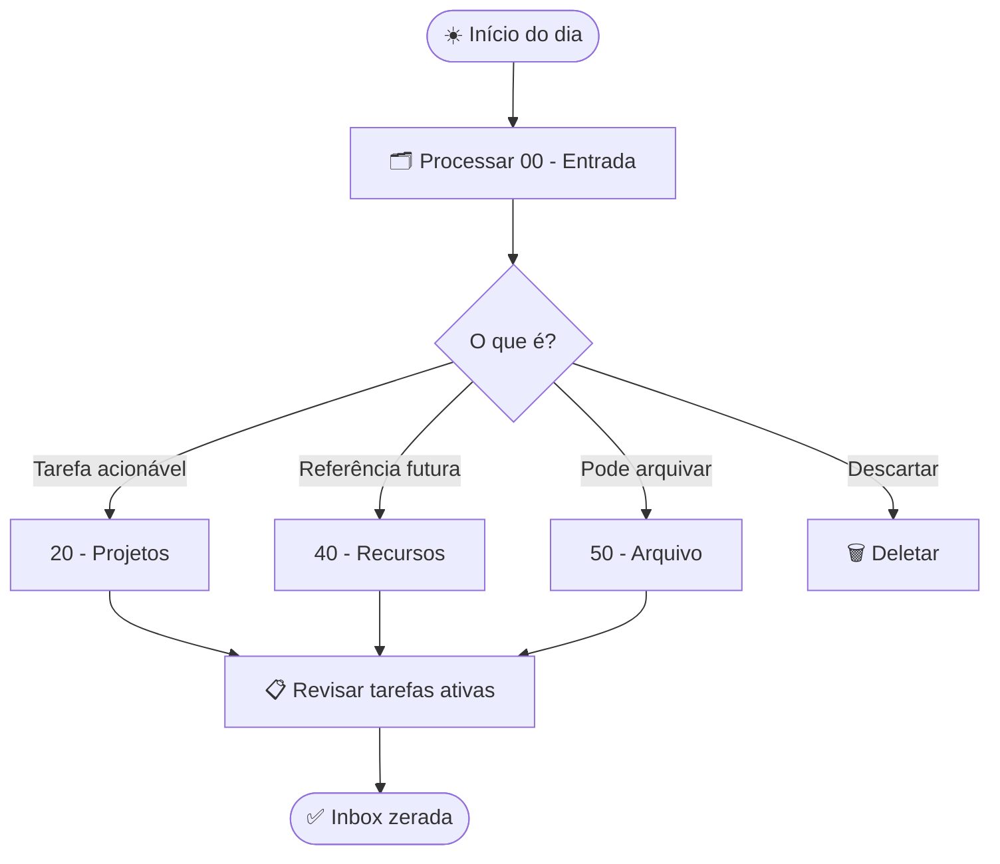
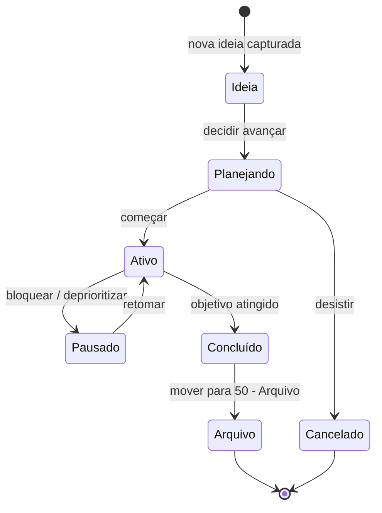

# mdt — Diagramas Mermaid Gerenciados por Template

> **For agentic workers:** REQUIRED SUB-SKILL: Use superpowers:subagent-driven-development (recommended) or superpowers:executing-plans to implement this plan task-by-task. Steps use checkbox (`- [ ]`) syntax for tracking.

**Goal:** Integrar `mdt_cli` para manter diagramas Mermaid inline nos guias do vault via templates versionados, e entregar ao usuário um kit inicial para criar e manter os próprios diagramas.

**Architecture:** Dois setups mdt independentes: (1) raiz do repo com `mdt.toml` — templates em `docs/diagrams/.templates/`, alvos nos `.md` do vault; CI valida com `mdt check` na raiz. (2) `99 - Meta e Anexos/Diagramas/` com `mdt.toml` próprio — kit do usuário, fora do escopo do CI.

**Tech Stack:** mdt_cli 0.7.0 (Rust/Cargo), Mermaid (inline em markdown), GitHub Actions

---

## Pré-requisito

Este spec deve ser implementado **após** o rename PT-BR (`docs/superpowers/plans/2026-05-19-renomear-pastas-pt-br-e-migrar-changesets.md`). Todos os paths usam os nomes novos.

---

## Estrutura de arquivos

```
repo root/
├── mdt.toml                                      ← config raiz (setup 1)
├── docs/diagrams/
│   └── .templates/
│       ├── vault-flow.t.md                       ← template do flowchart
│       └── para-structure.t.md                   ← template estrutura PARA
├── .github/workflows/
│   └── validate-mdt.yml                          ← CI: mdt check na raiz
├── .devcontainer/
│   └── post-create.sh                            ← adiciona cargo install mdt_cli
└── 99 - Meta e Anexos/
    ├── Visualização do Fluxo do Vault.md          ← alvo: recebe vault-flow
    ├── Entendendo a Estrutura de Pastas.md        ← alvo: recebe para-structure
    └── Diagramas/                                 ← setup 2 (user-facing)
        ├── mdt.toml
        ├── .templates/
        │   ├── vault-flow.t.md                   ← cópia de referência
        │   ├── para-structure.t.md               ← cópia de referência
        │   ├── daily-review.t.md                 ← starter pessoal
        │   └── project-lifecycle.t.md            ← starter pessoal
        └── Exemplos.md                           ← alvo pré-injetado
```

---

## Setup 1: Template-dev (raiz do repo)

### `mdt.toml` (raiz)

mdt escaneia recursivamente a partir do diretório onde `mdt.toml` está. Colocando na raiz, encontra templates em `docs/diagrams/.templates/*.t.md` e alvos com marcadores `<!-- {=blockname} -->` em qualquer `.md` do repo — incluindo `99 - Meta e Anexos/`.

```toml
[padding]
before = 0
after = 0
```

### Templates em `docs/diagrams/.templates/`

Cada template define um bloco nomeado com `<!-- {@nome} -->...<!-- {/nome} -->`. O conteúdo é Mermaid inline — sem SVG, sem build step. Obsidian e GitHub renderizam nativamente.

**`vault-flow.t.md`** — migra o diagrama existente de `Visualização do Fluxo do Vault.md` (flowchart de ~100 linhas). Os nomes de pasta dentro do diagrama (`00 - Inbox`, etc.) são atualizados para PT-BR como parte desta tarefa.

Estrutura do template:
```markdown
<!-- mdt template — run `mdt update` from repo root to sync, `mdt check` in CI -->

<!-- {@vault-flow} -->
```mermaid
flowchart TD
    ... (conteúdo do flowchart com nomes PT-BR)
```
<!-- {/vault-flow} -->
```

**`para-structure.t.md`** — novo diagrama para `Entendendo a Estrutura de Pastas.md`. Substitui a árvore de texto atual por um grafo Mermaid mostrando as 8 pastas e seus propósitos. Exemplo de estrutura:

```markdown
<!-- mdt template — run `mdt update` from repo root to sync, `mdt check` in CI -->

<!-- {@para-structure} -->

<!-- {/para-structure} -->
```

### Alvos nos `.md` do vault

**`99 - Meta e Anexos/Visualização do Fluxo do Vault.md`** — o bloco Mermaid inline atual é substituído pelos marcadores de injeção:

```markdown
<!-- {=vault-flow} -->
<!-- {/vault-flow} -->
```

**`99 - Meta e Anexos/Entendendo a Estrutura de Pastas.md`** — a seção `## Estrutura Base` com a árvore de texto é substituída pelos marcadores:

```markdown
## Estrutura Base

<!-- {=para-structure} -->
<!-- {/para-structure} -->
```

### Scripts em `package.json`

```json
"diagrams:update": "mdt update",
"diagrams:check": "mdt check"
```

---

## Setup 2: Kit do usuário (`99 - Meta e Anexos/Diagramas/`)

Esta pasta vai com o usuário via template. Ela tem seu próprio `mdt.toml` e é completamente independente do setup da raiz. O usuário roda `mdt update` a partir desta pasta para regenerar `Exemplos.md`.

### `mdt.toml` (em `Diagramas/`)

```toml
[padding]
before = 0
after = 0
```

### Templates em `.templates/`

- **`vault-flow.t.md`** — cópia do template de referência (mesmo conteúdo de `docs/diagrams/.templates/vault-flow.t.md`)
- **`para-structure.t.md`** — cópia do template de referência
- **`daily-review.t.md`** — starter: fluxo de revisão diária

```markdown
<!-- {@daily-review} -->

<!-- {/daily-review} -->
```

- **`project-lifecycle.t.md`** — starter: ciclo de vida de projeto

```markdown
<!-- {@project-lifecycle} -->

<!-- {/project-lifecycle} -->
```

### `Exemplos.md` (alvo pré-injetado)

```markdown
---
title: Diagramas do Vault
tags:
  - meta/diagramas
status: published
---
# Diagramas do Vault

Para atualizar após editar um template:

```bash
cd "99 - Meta e Anexos/Diagramas"
mdt update
```

## Fluxo do Vault
<!-- {=vault-flow} -->
<!-- {/vault-flow} -->

## Estrutura PARA
<!-- {=para-structure} -->
<!-- {/para-structure} -->

## Revisão Diária
<!-- {=daily-review} -->
<!-- {/daily-review} -->

## Ciclo de Vida de Projeto
<!-- {=project-lifecycle} -->
<!-- {/project-lifecycle} -->
```

Nota: os marcadores acima ficam vazios até o usuário rodar `mdt update` pela primeira vez. Após a injeção, `Exemplos.md` mostrará os diagramas renderizados.

---

## Devcontainer

Adicionar em `.devcontainer/post-create.sh`, na seção de ferramentas (antes do readiness gate):

```bash
cargo install mdt_cli --locked --version 0.7.0 \
  || echo "[aviso] mdt_cli install falhou. Execute: cargo install mdt_cli --locked --version 0.7.0"
```

---

## Documentação local (`Configurando Localmente.md`)

Adicionar seção sobre instalação do `mdt_cli` para uso fora do devcontainer:

```markdown
## mdt — Gerenciador de Templates de Diagramas

Instale via Cargo (requer Rust):

```bash
cargo install mdt_cli --locked --version 0.7.0
```

Para atualizar os diagramas do vault após editar um template:

```bash
# Diagramas dos guias (raiz do repo):
mdt update

# Kit pessoal:
cd "99 - Meta e Anexos/Diagramas" && mdt update
```
```

---

## CI — `validate-mdt.yml`

Trigger: mudanças em `docs/diagrams/**`, `mdt.toml`, ou nos dois `.md` alvo.

```yaml
name: Validate MDT Diagrams

on:
  pull_request:
    branches: [main, develop]
    paths:
      - "docs/diagrams/.templates/**"
      - "mdt.toml"
      - "99 - Meta e Anexos/Visualização do Fluxo do Vault.md"
      - "99 - Meta e Anexos/Entendendo a Estrutura de Pastas.md"
      - ".github/workflows/validate-mdt.yml"
  push:
    branches: [main]
    paths:
      - "docs/diagrams/.templates/**"
      - "mdt.toml"
  workflow_dispatch:
  schedule:
    - cron: "0 14 * * 3"

permissions:
  contents: read

jobs:
  validate:
    name: Check MDT diagram sync
    runs-on: ubuntu-latest
    timeout-minutes: 15

    steps:
      - name: Checkout
        uses: actions/checkout@de0fac2e4500dabe0009e67214ff5f5447ce83dd # v6.0.2

      - name: Cache mdt_cli
        id: cache-mdt
        uses: actions/cache@5a3ec84eff668545956fd18022155c47e93e2684 # v4.2.3
        with:
          path: ~/.cargo/bin/mdt
          key: ${{ runner.os }}-mdt-cli-0.7.0

      - name: Install mdt_cli
        if: steps.cache-mdt.outputs.cache-hit != 'true'
        run: cargo install mdt_cli --locked --version 0.7.0

      - name: Check MDT sync — vault diagrams
        run: mdt check
```

Nota: `actions/cache@5a3ec84eff668545956fd18022155c47e93e2684` é o hash da v4.2.3 — verificar hash atual antes de implementar em `https://github.com/actions/cache/releases`.

---

## O que não está no escopo

- Geração de SVG — Mermaid inline é suficiente para Obsidian e GitHub
- Verificação de `99 - Meta e Anexos/Diagramas/` no CI — é território do usuário
- Mais de dois diagramas no lado template-dev neste ciclo — iterar com novas demandas
